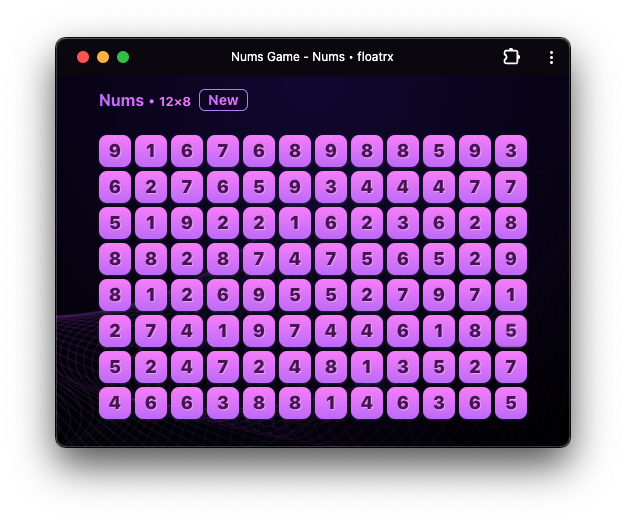
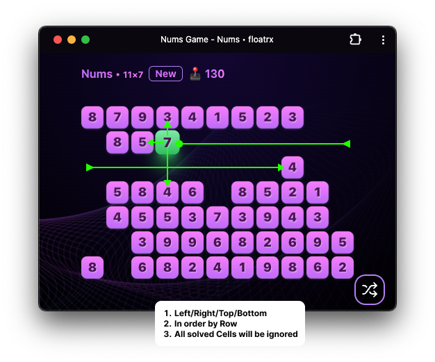

# Nums game (React + Vite)

### Demo https://nums.floatrx.net/
### WebView version https://github.com/floatrx/electron-webview

### Basic Game Rules

1. **Grid:**
   The game starts on a dynamic grid consisting of numbers from 1 to 9.

2. **Number Selection:**
   The user must choose two numbers according to the game rules.

3. **Adjacent Numbers:**

   - The user can only select adjacent numbers either vertically or horizontally.
   - Adjacent numbers are those with no unresolved cells between them.
   - The user can also select consecutive numbers in a row (e.g., the last number in the 1st row and the first number in the next row).

4. **Ignoring Resolved Cells:**
   All resolved cells are ignored when checking for adjacency.

### Scoring

5. **Selecting Identical Numbers:**
   The user can select two identical numbers to earn 2 points.

6. **Selecting Numbers Summing to 10:**
   The user can select two numbers whose sum equals 10 to earn 10 points.

### Booster System

7. **Booster Counter K:**
   For each successful selection, the game adds a booster counter K, which multiplies the points.
   - The counter can reach up to x100.
   - The counter resets to 1 after 5 seconds of inactivity.

### Shuffle Feature

8. **Shuffle Function:**
   The user can use the "shuffle" function, which regenerates all cell values, increasing the chances of winning.

### End of Game

9. **Final Score:**
   At the end of the game, the user sees their final score.
